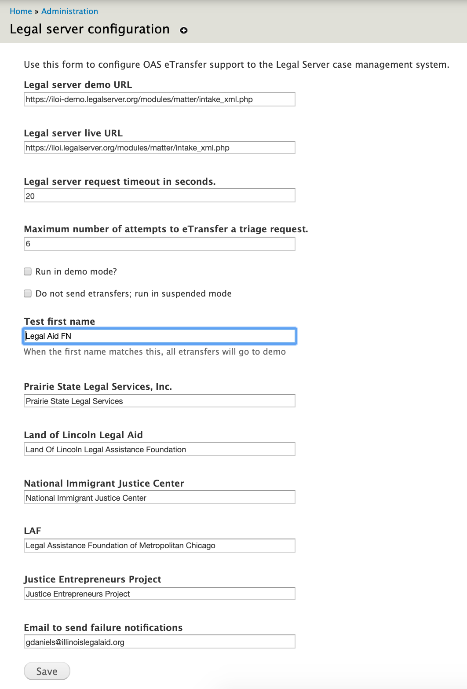

=======================
OAS Legal Server
=======================

This is the documentation for the oas_legal_server module.  This provides the functionality
to generate the data packet needed an sending it to the statewide instance of Legal Server case management system.

Dependencies
==============

* entity
* entityreference
* ilao_oas_financial_category
* oas_intake_settings

Unofficial dependencies
-------------------------

Configuration
==============

The module has a configuration interface that can be found at admin/intake/legal-server.

This interface is used to:
* Set the API urls to send etransfers
* Configure time outs and maximum retries
* Set the system to run in a demo mode (where eTransfers go to the demo server)
* Set the system to run suspended (where eTransfers are not sent)
* Sets a dummy first name, used for automated testing
* Sets the Legal server name for organizations.  This must match the organization name text in Legal Server.
* Sets an email notification address

Organizations are added to the configuration form when they have a service that accepts online intakes through IllinoisLegalAid.org

Permisssions
-------------
Module defines one permission to administer legal server.  This permission controls access to the configuration.

Functionality
===============
  
oas_legal_server_build_eTransfer accepts an array of client data and parses it into an XML packet that complies with the `Legal Server XML standard m <https://iloi-demo.legalserver.org/modules/matter/intake_xml.php>`_.

.. warning:: 
   There is a new REST-based API for intakes that needs to be implemented.
   
Upon attempting to send an eTransfer, it handles two instances of failure:

* malformed XML will generally require human re-submission
* server failures

A notification of either instance is sent from the module to the email contact in the configuration.